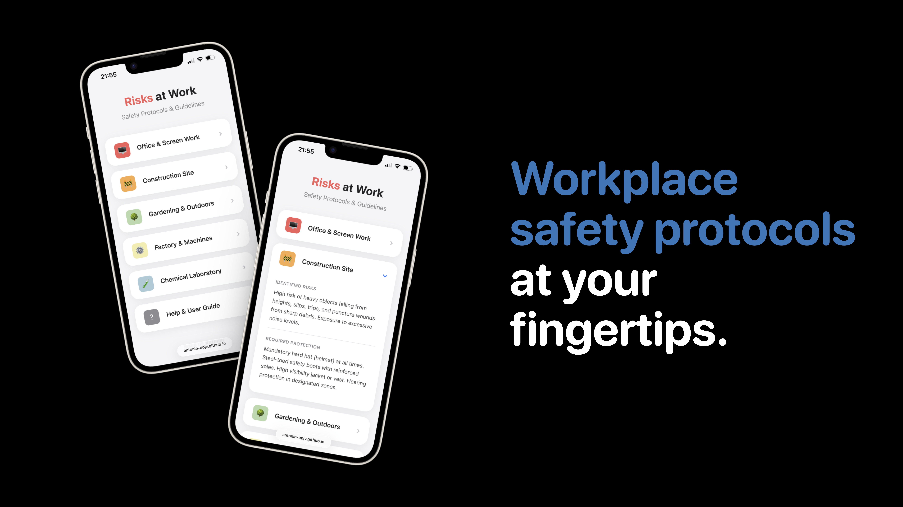

<h3 align="center">☀️ Day Mode</h3>

  
  

<h3 align="center">🌙 Night Mode</h3>

  
  

 

  <a href="https://antonin-upjv.github.io/risks_at_work/" target="_blank">
    <strong>🌐 Live Demo →</strong>
  </a>

